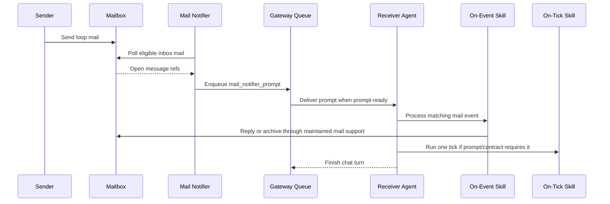

# Notifier-Prompt-Driven Mail Loop

Use this pattern when a Houmao-managed agent loop is driven by mailbox notifications: the gateway mail-notifier detects open mail, prompts the target agent, the agent processes one bounded mail round, optionally runs one bounded tick, then ends the chat turn.

This pattern is for loop runtime posture and wake-up composition. It is not a graph-planning skill, not a replacement for mailbox operations, and not a periodic worker framework.

## When To Choose This Pattern

Choose this pattern when:

- ordinary participant handoffs are mailbox messages,
- a live gateway mail-notifier is the wake-up mechanism for one or more participants,
- received mail should trigger generated on-event behavior,
- scheduling, reconciliation, timeout, or completion checks should run as one on-tick pass after mail processing,
- the user or loop author needs to customize notifier prompt guidance for a specific loop.

Use `houmao-process-emails-via-gateway` directly when the task is only one notifier-driven open-mail round.

Use `houmao-agent-email-comms` directly when the task is only one ordinary list, read, send, reply, mark, move, or archive action.

Use `houmao-agent-loop-lite` when the user explicitly wants notifier-driven generated skills from Markdown contracts, typed Markdown templates, and direct SQLite state.

Use `houmao-agent-loop-pro` when the user needs topology authoring, graph decomposition, schema-rich generated execplans, or generated loop run control.

## Runtime Model

Houmao agents do not run a conventional in-chat event loop.

The runtime model is:

1. Mailbox state exists outside the agent chat turn.
2. The gateway mail-notifier runs separately from the target agent.
3. The notifier polls eligible inbox mail.
4. When the gateway is prompt-ready, the notifier enqueues one `mail_notifier_prompt`.
5. The target agent receives that prompt.
6. The agent processes relevant mail through maintained Houmao mail support.
7. The agent invokes loop-specific on-event behavior for the received message family when applicable.
8. The agent invokes one on-tick pass after mail processing when the notifier prompt or loop contract says to do so.
9. The agent archives only successfully processed mail.
10. The agent ends the chat turn.

There is no separate periodic tick driver. On-tick skills are invoked from a notifier or operator prompt turn, do one bounded pass, and stop.

## Skill Composition

Use these maintained Houmao skills together:

- `houmao-agent-gateway` for gateway attach, discovery, and mail-notifier enable/status/disable.
- `houmao-process-emails-via-gateway` for the round-oriented open-mail workflow after a notifier prompt supplies the gateway base URL.
- `houmao-agent-email-comms` for lower-level mailbox status, list, peek, read, send, reply, mark, move, and archive operations.
- `houmao-agent-messaging` only when the loop also needs explicit prompt or interrupt routing outside ordinary mail.

Generated loop skills may define on-event and on-tick behavior, but they should delegate mailbox mechanics to the maintained mail skills.

## Flow



## Workflow

1. Confirm the target participant has a mailbox binding and live attached gateway.
2. Use `houmao-agent-gateway` to inspect or enable the gateway mail-notifier.
3. If the loop needs follow-up tick behavior, configure notifier appendix guidance that says which tick to run after mail processing.
4. Send loop mail through `houmao-agent-email-comms`, generated loop mail tooling, or the gateway `/v1/mail/send|post|reply` surface.
5. Include a short `notify_block` only when the sender needs prominent wake-up guidance in the notifier prompt.
6. When the notifier prompt arrives, use `houmao-process-emails-via-gateway` for the current open-mail round when available.
7. For each relevant loop mail item, invoke the matching generated on-event behavior or apply the loop-specific event procedure.
8. Send required replies through maintained mail support.
9. Archive the processed mail only after required work and required replies succeed.
10. If the prompt or loop contract says to tick, run the specified on-tick behavior once.
11. End the chat turn. Do not wait for more mail inside the same turn.

## Gateway Mail API Contract

When a notifier prompt supplies `Gateway: <base-url>`, the live mailbox facade is available under that base URL.

Common routes:

- `GET /v1/mail/status`: confirm transport, principal id, mailbox address, and binding version.
- `POST /v1/mail/list`: list message metadata; set `include_body=true` only when full bodies are needed.
- `POST /v1/mail/peek`: inspect one message without marking it read.
- `POST /v1/mail/read`: inspect one message and mark it read.
- `POST /v1/mail/reply`: reply to one message by opaque `message_ref`.
- `POST /v1/mail/send`: send a new participant mail item.
- `POST /v1/mail/post`: post an operator-origin mailbox note.
- `POST /v1/mail/mark|move|archive`: mutate read, answered, archived, or box state.
- `GET|PUT|DELETE /v1/mail-notifier`: inspect, configure, or disable notifier polling.

`message_ref` and `thread_ref` are opaque. Do not parse filesystem ids, JMAP ids, timestamps, paths, or routing facts out of them. Store them only as references for reply, archive, audit, and recovery.

Minimal check/read/reply/archive shape:

```bash
curl -sS "$GATEWAY_BASE_URL/v1/mail/list" \
  -H 'content-type: application/json' \
  -d '{"schema_version":1,"box":"inbox","archived":false,"include_body":false}'

curl -sS "$GATEWAY_BASE_URL/v1/mail/read" \
  -H 'content-type: application/json' \
  -d '{"schema_version":1,"message_ref":"<message-ref>"}'

curl -sS "$GATEWAY_BASE_URL/v1/mail/reply" \
  -H 'content-type: application/json' \
  -d '{"schema_version":1,"message_ref":"<message-ref>","body_content":"Done.","attachments":[]}'

curl -sS "$GATEWAY_BASE_URL/v1/mail/archive" \
  -H 'content-type: application/json' \
  -d '{"schema_version":1,"message_refs":["<message-ref>"]}'
```

Prefer the maintained mail skills over raw `curl` during normal agent work. Use raw HTTP only when debugging, documenting, or implementing a generated harness surface that has an explicit gateway base URL.

## Notifier Prompt Contract

The gateway mail-notifier renders one prompt from the packaged notifier template. The rendered prompt includes:

- optional sender-authored notify blocks in a prepend slot,
- tool-specific mailbox skill guidance,
- notifier mode guidance,
- `Gateway: <base-url>`,
- a compact `/v1/mail/*` API summary,
- optional `appendix_text`,
- optional sender-authored notify blocks in an append slot.

`appendix_text` is loop-level runtime guidance configured on the notifier. Use it for stable loop instructions such as:

```text
After processing relevant inbox mail, invoke `lead-on-schedule-tick` once, then end the chat turn.
```

Do not use `appendix_text` as the only copy of the loop protocol. The loop protocol belongs in generated contracts, message schemas, generated skills, and harness surfaces.

## Sender Notify Blocks

`notify_block` is a short sender-authored notice that the notifier may render directly into the wake-up prompt.

Important boundary:

- the full mail body is not injected into the prompt;
- the full body stays in the mailbox and must be read through mail support;
- only the short `notify_block.text` is rendered into the notifier prompt, subject to notifier trust and size controls.

There are two authoring paths.

Body fence path:

```bash
pixi run houmao-mgr agents single --agent-name sender mail send \
  --to receiver@houmao.localhost \
  --subject "Loop handoff" \
  --body-content $'Loop handoff details are in this message.\n\n```houmao-notify\nAfter reading this handoff, run receiver-on-handoff-received, then run receiver-on-schedule-tick once.\n```'
```

Explicit field path:

```bash
pixi run houmao-mgr agents single --agent-name receiver mail post \
  --subject "Continue loop" \
  --body-content "Operator note for the current loop." \
  --notify-block "Process loop mail, run the lead tick once, then stop." \
  --notify-block-placement prepend
```

Rules:

- use `notify_block` for wake-up hints, not full instructions;
- default per-message rendered text cap is 512 characters;
- default total rendered notify-block budget per prompt is 2048 characters;
- when the body has several `houmao-notify` fences, only the first non-empty fence becomes the canonical notify block;
- explicit `--notify-block` bypasses body-fence extraction and is mirrored back into the stored body when needed;
- notifier trust posture may suppress notify-block rendering.

## Tick Boundary

Use on-tick behavior for responsibilities that are not owned by one received mail event:

- aggregate several replies,
- schedule the next handoff,
- reconcile state,
- check timeout posture,
- check completion posture,
- decide that no action is currently applicable.

The tick must:

1. read current state through generated specs, records, mailbox state, or harness commands,
2. perform the first applicable bounded action or report no action,
3. send any resulting mail through maintained mail support,
4. update loop-local records when applicable,
5. stop.

Do not run ticks in a loop. Do not sleep until the next tick. Do not keep the chat turn open while waiting for future mail.

## Guardrails

- Do not implement mailbox polling in generated skills.
- Do not ask agents to sleep, poll, tail logs, or wait in-chat for loop progress.
- Do not describe on-tick skills as periodic background workers.
- Do not rely on a hidden external periodic driver to invoke ticks.
- Do not archive mail before required replies and record updates succeed.
- Do not store important loop semantics only in notifier appendix text or notify blocks.
- Do not parse `message_ref` or `thread_ref`.
- Do not use this pattern as a replacement for dedicated loop planning when topology, execplan generation, or run control is required.
