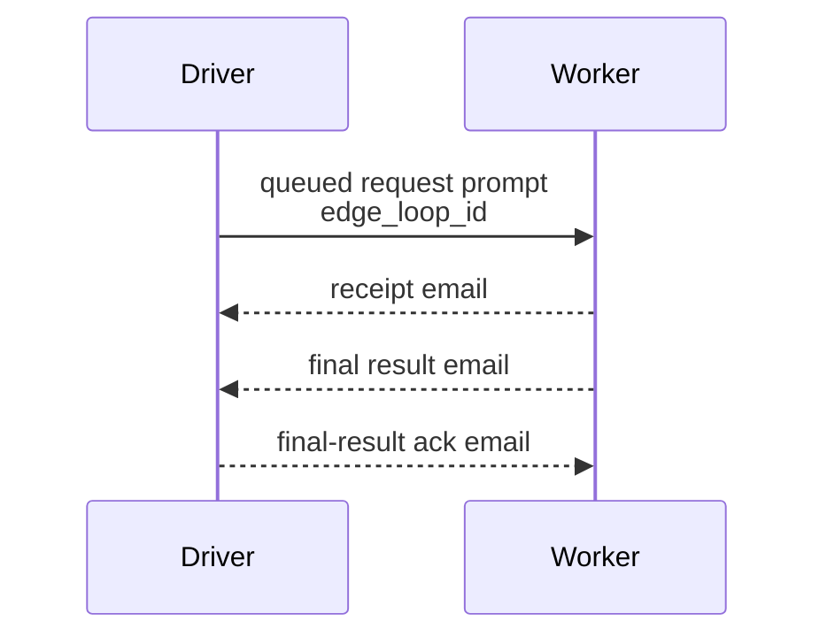

# Local-Close Driver-Worker Edge Loop Via Gateway Handoff And Mailbox Return

Compatibility alias: `pairwise edge-loop`.

Use this pattern when one Houmao-managed agent acts as a driver, sends work to exactly one worker for one loop round, and expects that same worker to return the final result back to that same driver.

This pattern is for supported composition over existing Houmao skills. It assumes all participating agents already have live attached gateways for this run. It is not the durable fallback pattern for gateway restart, gateway loss, or managed-agent replacement.

## When To Choose This Pattern

Choose this pattern when:

- one driver sends one request to exactly one worker for one elemental edge-loop round,
- the agent that sends the request should also be the agent that receives the final result for that same loop round,
- the sender needs robust resend and deduplication behavior under ambiguous network outcomes,
- the sender can maintain a small mutable loop ledger through mailbox/reminder state or an operator-designated work artifact path.

Use the forward relay-loop pattern instead when ownership should keep moving forward across agents and a later downstream loop egress should return the final result directly to a more distant origin.

Use `houmao-agent-loop-lite` instead when the user explicitly wants to package this kind of small loop as generated skills with typed Markdown templates and direct SQLite state.

Use `houmao-agent-loop-pro` in `tree-loop` mode instead when the user needs recursive child loops, multiple local-close edges, a rendered control graph, schema-rich generated execplans, or generated loop run-control actions.

Do not choose this pattern for one direct prompt, one direct email, or one local self-reminder. Use the lower-level skills directly for those simpler tasks.

## Roles And Skill Composition

Use these role names consistently for one edge-loop round:

- `driver`: the agent that sends the request and waits for the final result back from the same worker
- `worker`: the agent that receives the request, performs the work, and returns the final result back to the same driver

Use these maintained Houmao skills together:

- `houmao-agent-messaging` for queued gateway prompt handoff between already-running managed agents
- `houmao-agent-email-comms` for receipt email, final result email, and final-result acknowledgement email
- `houmao-agent-gateway` for live supervisor reminders
- `houmao-agent-inspect` for read-only downstream worker peeking before due resends

## Local-Close Flow



Every resend of the same edge-loop round reuses the same `edge_loop_id`.

Unlike the forward relay-loop pattern, the worker for one edge-loop round is also the default source of the final result for that same round. The result does not bypass the immediate driver.

This page intentionally covers only the elemental two-node round. Use `houmao-agent-loop-lite` for a small generated-skill package with typed Markdown templates and direct SQLite state, or use `houmao-agent-loop-pro` in `tree-loop` mode for recursive child edge-loops, multiple local-close edges, schema-rich generated execplans, or a rendered control graph.

## Mutable Loop State

Each agent that drives or owns local-close edge-loop work keeps a small mutable ledger outside Houmao managed memory. Treat this as pattern bookkeeping, not operator-facing memo/page memory.

Location guidance:

```text
Use mailbox records, reminder state, runtime state, or an operator-designated work artifact path for mutable counters and dedupe state. If operators need a readable checkpoint, write a concise summary page under $HOUMAO_AGENT_PAGES_DIR/edge-loops/.
```

Minimum fields to record for each active outbound or owned edge-loop:

- `edge_loop_id`
- `role`
- `peer_agent`
- `phase`
- `sent_at`
- `next_review_at`
- `receipt_due_at`
- `result_due_at`
- `result_ack_due_at` when relevant
- `attempt_count`
- `max_attempts` or `give_up_at`
- `last_receipt_ref`
- `last_result_ref`
- `last_result_ack_ref`

Workers also need a durable-enough per-session record of seen inbound `edge_loop_id` values so they can deduplicate repeated requests.

Do not use Houmao managed memory pages as the default home for short-lived retry counters, due times, and seen-request markers. Pages are for readable operator-facing context.

## Driver Workflow

Whenever one agent acts as the driver for one edge-loop round:

1. Persist or update the local ledger row first.
2. Send the queued request prompt to the worker through `houmao-agent-messaging`.
3. Arm or refresh the driver's follow-up mechanism.
4. Stop the current round. Do not wait actively inside one live LLM turn for downstream mail.

The driver's retry rule is always:

1. check mailbox first,
2. update the ledger from any matching receipt, final result, or final-result acknowledgement,
3. if the expected signal is still missing and the loop is due, use `houmao-agent-inspect` to peek the downstream worker for the same `edge_loop_id`,
4. if read-only inspection shows the worker still owns or is actively working on that `edge_loop_id`, update `next_review_at` and do not resend,
5. if read-only inspection is unavailable, stale, or inconclusive and the resend decision remains ambiguous, use a narrow active prompt, ping, or direct `houmao-agent-messaging` status probe only as a last resort before resend,
6. resend only when the expected signal is still missing, the loop is due, and the worker cannot be observed or confirmed as still owning or actively working on the same `edge_loop_id`,
7. resend with the same `edge_loop_id`.

## Worker Workflow

Whenever one agent receives one edge-loop request:

1. Check whether the same `edge_loop_id` was already seen.
2. If already seen, resend the matching receipt or final result and stop. Do not duplicate work.
3. If new, persist ownership in the local ledger.
4. Send a receipt email to the driver.
5. Complete the work locally for this elemental round.
6. Send the final result email back to the same driver.
7. Keep follow-up until the driver's final-result acknowledgement arrives.

If the worker needs a recursive tree loop, multiple downstream workers, or a rendered control graph, use `houmao-agent-loop-pro` instead of expanding this elemental protocol inline. If the operator wants only a small reusable generated-skill package around the elemental protocol, use `houmao-agent-loop-lite`.

## Thresholds And User Input

Houmao gives you timing primitives, not one universal edge-loop timeout table. Treat receipt deadlines, result deadlines, review cadence, retry spacing, and retry horizon as workflow-policy values.

Choose those values from:

- explicit user deadlines or service expectations,
- current task urgency,
- how many active elemental edge-loop rows the driver is tracking,
- the chosen supervisor reminder cadence,
- the fact that reminders and notifier wakeups only dispatch when the gateway is ready.

If a timing value is materially important to correctness or to the user's expectation and you cannot choose it sensibly from the current context, ask the user for that value instead of inventing an arbitrary threshold. Treat that as a Houmao system-operation question: separate `Required` timing/posture values from `Optional` defaults, modifiers, or skip choices.

Keep these concepts separate in the ledger:

- `next_review_at`: when the driver or worker will look again
- `receipt_due_at`: when a missing receipt is considered late
- `result_due_at`: when the overall edge-loop result is considered late
- `result_ack_due_at`: when the worker should chase the final-result acknowledgement
- `give_up_at` or `max_attempts`: when the loop should escalate or fail

## Default Supervision Model

For one agent with active elemental edge-loop rows in flight, the default model is:

- one local loop ledger as the authoritative mutable state,
- one repeating supervisor reminder as the live loop clock,
- optional self-mail checkpoint or backlog marker when the sender wants an additional durable backlog anchor.

Do not create one live reminder per active edge-loop row as the default pattern. The current reminder system only dispatches one effective reminder at a time, so many per-row reminders block one another.

The supervisor reminder should reopen the loop ledger, check mailbox first, advance any completed rows, peek due workers through `houmao-agent-inspect`, use active status probes only as the last resort for ambiguous rows, resend only rows whose workers cannot be observed or confirmed as still working, and then stop.

## Optional Self-Mail Checkpoint

If the agent wants a durable backlog marker in addition to the live supervisor reminder, one open self-mail checkpoint per agent is acceptable. Use it as a pointer back to the active ledger location or a readable summary page, not as the authoritative mutable edge-loop ledger itself.

If unchanged open self-mail remains in the mailbox, later notifier cycles may still re-enqueue wake prompts while it remains unarchived. Keep the checkpoint idempotent and prune it when no longer needed.

## Templates

### Edge-loop request

```text
Role:
You are the worker for edge-loop `<edge_loop_id>`.

Action:
Take ownership of this edge-loop request and return the final result to the same driver.

Driver:
<agent identity and mailbox address>

Required receipt:
Send a receipt email back to `<driver>` after you persist ownership.

Required final result:
Send the final result email back to `<driver>` for edge-loop `<edge_loop_id>`.

Local ledger requirements:
Record edge_loop_id, peer identity, current phase, next_review_at, receipt_due_at, result_due_at, result_ack_due_at if applicable, attempt_count, and any matching mail refs.

Timing:
next_review_at = <time or condition>
receipt_due_at = <time or condition>
result_due_at = <time or condition>
max_attempts or give_up_at = <policy>
```

### Receipt email

```text
Subject: [edge-receipt] edge_loop=<edge_loop_id>

Receipt status:
I persisted ownership of edge-loop `<edge_loop_id>`.

Worker identity:
<agent identity and mailbox address>

Driver identity:
<agent identity and mailbox address>

Current phase:
<working locally | preparing final result>

Next review or due state:
next_review_at = <time or condition>
result_due_at = <time or condition>
```

### Final result email

```text
Subject: [edge-result] edge_loop=<edge_loop_id>

Worker identity:
<agent identity and mailbox address>

Driver identity:
<agent identity and mailbox address>

Result summary:
<final information for the driver>

Completion basis:
This edge-loop is complete once the driver sends final-result acknowledgement for `<edge_loop_id>`.
```

### Final-result acknowledgement email

```text
Subject: [edge-result-ack] edge_loop=<edge_loop_id>

Driver identity:
<agent identity and mailbox address>

Worker identity:
<agent identity and mailbox address>

Ack status:
The driver received and recorded the final result for edge-loop `<edge_loop_id>`.

Completion:
You may mark the worker row complete and stop follow-up for this edge-loop.
```

### Supervisor reminder text

```text
Title: [edge-supervisor] review active edge loops
Prompt: Reopen the active edge-loop ledger, check mailbox first for edge-loop receipts, results, and result acknowledgements, advance completed rows, use `houmao-agent-inspect` to peek workers for due rows, use a narrow active status probe only as the last resort when read-only inspection is inconclusive, resend only due rows whose workers cannot be observed or confirmed as still working, reuse the same edge_loop_id for any resend, update next_review_at and attempt_count, then stop.
Ranking: <smaller value = higher priority>
Mode: repeat
Start after: <context-derived delay>
Interval: <context-derived supervisor_interval_seconds>
```

### Optional self-mail listpoint text

```text
Subject: [edge-backlog] reopen edge-loop ledger

Reason:
This unread self-mail is only a durable checkpoint pointer for active edge-loops.

Reopen:
the active edge-loop ledger or its readable summary page

Required review:
Check mailbox first for matching edge-loop receipts, results, and result acknowledgements, peek due workers through `houmao-agent-inspect`, and use active status probes only as the last resort before resending any request.

Prune condition:
Delete or mark this checkpoint complete once the edge-loop ledger is empty.
```

## Guardrails

- Do not describe this pattern as a transactional distributed workflow engine.
- Do not wait inside one live provider turn for downstream email.
- Do not invent a fresh `edge_loop_id` for ordinary resend of the same round.
- Do not teach recursive child edge-loops, parent edge-loop identifiers, or multi-edge graph planning as part of this elemental pattern.
- Do not use one live reminder per active edge-loop row as the default supervision strategy.
- Do not store mutable edge-loop bookkeeping in Houmao managed memory pages.
- Do not guess materially important timing thresholds when the user needs to set them.
