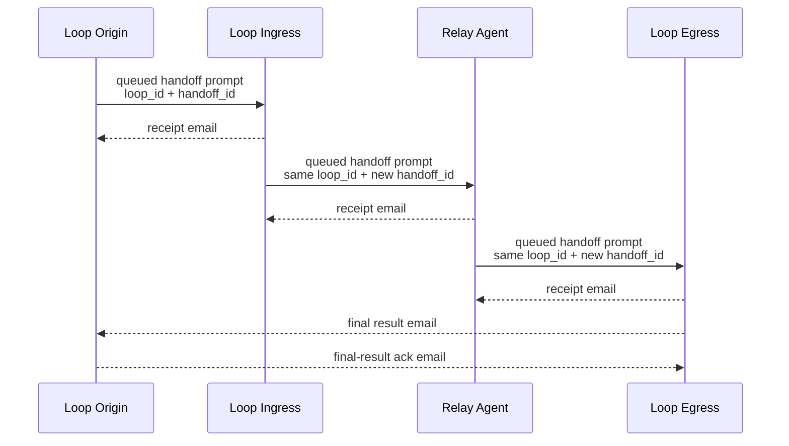

# Multi-Agent Relay Loop Via Gateway Handoff And Mailbox Exit

Use this pattern when one Houmao-managed master or loop origin needs to drive one ordered N-node relay lane that enters at one live-gateway agent, may transit across additional live-gateway agents, and exits back to the origin through mailbox email.

This pattern is for supported composition over existing Houmao skills. It assumes all participating agents already have live attached gateways for this run. It is not the durable fallback pattern for gateway restart, gateway loss, or managed-agent replacement.

## When To Choose This Pattern

Choose this pattern when:

- one managed agent acts as the master or loop origin for one ordered relay lane,
- the downstream work should hop forward through one ordered sequence of live managed agents before completion,
- the designated loop egress must return the final result to the loop origin through mailbox email,
- the sender needs robust resend and deduplication behavior under ambiguous network outcomes,
- the sender can maintain a small mutable loop ledger through mailbox/reminder state or an operator-designated work artifact path.

Use `houmao-agent-loop-lite` instead when the user explicitly wants to package a small relay as generated skills with typed Markdown templates and direct SQLite state.

Use `houmao-agent-loop-pro` instead when the user needs multi-lane routing, fan-out, mixed local-close/relay graph planning, graph policy authoring, a rendered graph, schema-rich generated execplans, or generated loop run-control actions.

Do not choose this pattern for one direct prompt, one direct email, or one local self-reminder. Use the lower-level skills directly for those simpler tasks.

## Roles And Skill Composition

Use these role names consistently:

- `loop origin`: the master agent that starts the workflow and expects the final result back
- `loop ingress`: the first downstream agent that receives the origin's queued handoff
- `relay agent`: any intermediate agent that receives one handoff and forwards a later handoff
- `loop egress`: the final downstream agent that returns the final result to the origin by email

Use these maintained Houmao skills together:

- `houmao-agent-messaging` for queued gateway prompt handoff between already-running managed agents
- `houmao-agent-email-comms` for receipt email, final result email, and final-result acknowledgement email
- `houmao-agent-gateway` for live supervisor reminders
- `houmao-agent-inspect` for read-only downstream peeking before due relay handoff resends

## End-To-End Flow



Every hop uses the same `loop_id` and a hop-specific `handoff_id`. A repeated send for the same hop must reuse the same `handoff_id`.

The loop egress still sends an immediate receipt to its direct upstream sender before or alongside returning the final result to the origin. Otherwise the previous hop never learns that the egress owns the work.

## Mutable Loop State

Each agent that owns or sends relay-loop work keeps a small mutable ledger outside Houmao managed memory. Treat this as pattern bookkeeping, not operator-facing memo/page memory.

Location guidance:

```text
Use mailbox records, reminder state, runtime state, or an operator-designated work artifact path for mutable counters and dedupe state. If operators need a readable checkpoint, write a concise summary page under $HOUMAO_AGENT_PAGES_DIR/relay-loops/.
```

Minimum fields to record for each active outbound or owned handoff:

- `loop_id`
- `handoff_id`
- `role`
- `upstream_agent`
- `downstream_agent`
- `phase`
- `sent_at`
- `next_review_at`
- `receipt_due_at`
- `result_due_at` when relevant
- `attempt_count`
- `max_attempts` or `give_up_at`
- `last_receipt_ref`
- `last_result_ref`
- `last_result_ack_ref`

Receivers also need a durable-enough per-session record of seen inbound `handoff_id` values so they can deduplicate repeated sends.

Do not use Houmao managed memory pages as the default home for short-lived retry counters, due times, and seen-handoff markers. Pages are for readable operator-facing context.

## Sender Workflow

Whenever one agent sends a downstream handoff:

1. Persist or update the local ledger row first.
2. Send the queued gateway prompt to the downstream agent through `houmao-agent-messaging`.
3. Arm or refresh the sender's follow-up mechanism.
4. Stop the current round. Do not wait actively inside one live LLM turn for downstream mail.

The sender's retry rule is always:

1. check mailbox first,
2. update the ledger from any matching receipt, final result, or final-result acknowledgement,
3. if the expected signal is still missing and the handoff is due, use `houmao-agent-inspect` read-only surfaces to peek the downstream agent for the same `loop_id` and `handoff_id`,
4. if read-only inspection shows the downstream agent still owns or is actively working on that handoff, update `next_review_at` and do not resend,
5. if read-only inspection is unavailable, stale, or inconclusive and the resend decision remains ambiguous, use a narrow active prompt, ping, or direct `houmao-agent-messaging` status probe only as a last resort before resend,
6. resend only when the expected signal is still missing, the handoff is due, and the downstream agent cannot be observed or confirmed as still owning or actively working on the same `loop_id` and `handoff_id`,
7. resend with the same `loop_id` and the same `handoff_id`.

## Receiver Workflow

Whenever one agent receives a downstream handoff:

1. Check whether the same `loop_id` and `handoff_id` were already seen.
2. If already seen, resend the matching receipt or final result and stop. Do not forward duplicate downstream work.
3. If new, persist ownership in the local ledger.
4. Send a receipt email to the immediate upstream sender.
5. If this agent is a relay, create the next downstream handoff and arm follow-up for that next hop.
6. If this agent is the loop egress, send the final result email to the loop origin and wait for a final-result acknowledgement email.

## Thresholds And User Input

Houmao gives you timing primitives, not one universal relay-loop timeout table. Treat receipt deadlines, result deadlines, review cadence, retry spacing, and retry horizon as workflow-policy values.

Choose those values from:

- explicit user deadlines or service expectations,
- current task urgency,
- how many active handoff rows the sender is tracking,
- the chosen supervisor reminder cadence,
- the fact that reminders and notifier wakeups only dispatch when the gateway is ready.

If a timing value is materially important to correctness or to the user's expectation and you cannot choose it sensibly from the current context, ask the user for that parameter instead of inventing an arbitrary threshold. Treat that as a Houmao system-operation question: separate `Required` timing/posture values from `Optional` defaults, modifiers, or skip choices.

Keep these concepts separate in the ledger:

- `next_review_at`: when the sender will look again
- `receipt_due_at`: when a missing receipt is considered late
- `result_due_at`: when the overall workflow result is considered late
- `give_up_at` or `max_attempts`: when the loop should escalate or fail

## Default Supervision Model

For one sender with active handoff rows in one ordered relay lane, the default model is:

- one local loop ledger as the authoritative mutable state,
- one repeating supervisor reminder as the live loop clock,
- optional self-mail checkpoint or backlog marker when the sender wants an additional durable backlog anchor.

Do not create one live reminder per active handoff row as the default pattern. The current reminder system only dispatches one effective reminder at a time, so many per-row reminders block one another.

The supervisor reminder should reopen the loop ledger, check mailbox first, advance any completed rows, peek due downstream agents through `houmao-agent-inspect`, use active status probes only as the last resort for ambiguous rows, resend only rows whose downstream agents cannot be observed or confirmed as still working, and then stop.

## Optional Self-Mail Checkpoint

If the sender wants a durable backlog marker in addition to the live supervisor reminder, one open self-mail checkpoint per agent is acceptable. Use it as a pointer back to the active ledger location or a readable summary page, not as the authoritative mutable loop ledger itself.

If unchanged open self-mail remains in the mailbox, later notifier cycles may still re-enqueue wake prompts while it remains unarchived. Keep the checkpoint idempotent and prune it when no longer needed.

## Templates

### Downstream handoff request

```text
Loop role:
<loop origin | loop ingress | relay agent | loop egress target>

Action:
Take ownership of relay-loop handoff `<handoff_id>` within loop `<loop_id>`.

Upstream sender:
<agent identity and mailbox address>

Loop origin:
<agent identity and mailbox address>

Downstream target:
<next agent identity, or "you are the loop egress">

Required receipt:
Send a receipt email back to `<upstream sender>` after you persist ownership.

If you are the loop egress:
Send the final result email to `<loop origin>`, then wait for final-result acknowledgement.

Local ledger requirements:
Record loop_id, handoff_id, upstream sender, downstream target, current phase, next_review_at, receipt_due_at, result_due_at if applicable, attempt_count, and any matching mail refs.

Timing:
next_review_at = <time or condition>
receipt_due_at = <time or condition>
result_due_at = <time or condition if applicable>
max_attempts or give_up_at = <policy>
```

### Receipt email

```text
Subject: [relay-receipt] loop=<loop_id> handoff=<handoff_id>

Receipt status:
I persisted ownership of handoff `<handoff_id>` in loop `<loop_id>`.

Receiver role:
<loop ingress | relay agent | loop egress>

Receiver identity:
<agent identity and mailbox address>

Upstream sender:
<agent identity and mailbox address>

Current phase:
<awaiting downstream receipt | preparing final result | other>

Next review or due state:
next_review_at = <time or condition>
receipt_due_at = <time or condition if another downstream hop exists>
```

### Final result email

```text
Subject: [relay-result] loop=<loop_id> result=<result_id>

Loop egress:
<agent identity and mailbox address>

Loop origin:
<agent identity and mailbox address>

Result summary:
<final information for the loop origin>

Completion basis:
This result closes loop `<loop_id>` once the loop origin sends final-result acknowledgement.

Relevant refs:
handoff_id = <last handoff handled by the egress>
last_receipt_ref = <message ref if useful>
```

### Final-result acknowledgement email

```text
Subject: [relay-result-ack] loop=<loop_id> result=<result_id>

Loop origin:
<agent identity and mailbox address>

Loop egress:
<agent identity and mailbox address>

Ack status:
The loop origin received and recorded the final result for loop `<loop_id>`.

Completion:
You may mark the loop egress row complete and stop follow-up for result `<result_id>`.
```

### Supervisor reminder text

```text
Title: [relay-supervisor] review active relay handoffs
Prompt: Reopen the active relay-loop ledger, check mailbox first for relay receipts, results, and result acknowledgements, advance completed rows, use `houmao-agent-inspect` to peek downstream agents for due rows, use a narrow active status probe only as the last resort when read-only inspection is inconclusive, resend only due rows whose downstream agents cannot be observed or confirmed as still working, reuse the same loop_id and handoff_id for any resend, update next_review_at and attempt_count, then stop.
Ranking: <smaller value = higher priority>
Mode: repeat
Start after: <context-derived delay>
Interval: <context-derived supervisor_interval_seconds>
```

### Optional self-mail listpoint text

```text
Subject: [relay-backlog] reopen relay-loop ledger

Reason:
This unread self-mail is only a durable checkpoint pointer for active handoffs in the relay lane.

Reopen:
the active relay-loop ledger or its readable summary page

Required review:
Check mailbox first for matching relay receipts, results, and result acknowledgements, peek due downstream agents through `houmao-agent-inspect`, and use active status probes only as the last resort before resending any handoff.

Prune condition:
Delete or mark this checkpoint complete once the relay-loop ledger is empty.
```

## Guardrails

- Do not describe this pattern as a transactional distributed workflow engine.
- Do not wait inside one live provider turn for downstream email.
- Do not invent a fresh `handoff_id` for ordinary resend of the same hop.
- Do not use mailbox thread ancestry alone as the workflow identity.
- Do not teach fan-out, multiple relay lanes, or a graph of relay loops as part of this elemental pattern.
- Do not use one live reminder per active handoff row as the default supervision strategy.
- Do not store mutable relay-loop bookkeeping in Houmao managed memory pages.
- Do not guess materially important timing thresholds when the user needs to set them.
